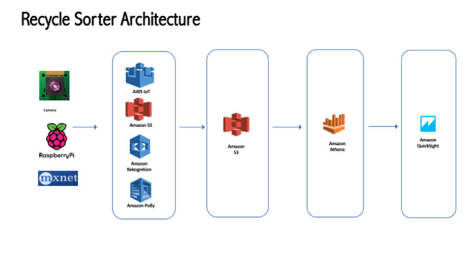

### Real time object detection using Mxnet and Amazon Rekogntion on Raspberry Pi
As AWS continues to support the Artificial Intelligence (AI) community with contributions to Apache MXNet and the release of Amazon Lex, Amazon Polly, and Amazon Rekognition managed services, these services are enabling many innovative use cases. In this project I will walk through how to build real-time object detection using Mxnet, Amazon Rekognition and Amazon Polly on Raspberry Pi. Use case is to identify an object in front of the Raspberry Pi camera. Identify if the object is recyclable. First try to find the object locally at Raspberry Pi, if object is not identified locally then use cloud based service. Announce any identified object. Send all identified object labels to cloud for analysis and visualization.

So, we will build object detection locally in Pi using MXNet. Then use Amazon Rekognition for second pass at object detection. Announce object detection using Amazon Polly. Send all detected labels to AWS S3 through AWS IoT. Analyze and visualize object identification data using Amazon Quicksight, through Amazon Athena.


Here is the architecture for finding "recyclable" objects:


Prerequisites:

- [Raspberry Pi 3 with Pi Camera](https://www.raspberrypi.org/blog/raspberry-pi-3-on-sale)
- [A Raspberry Pi 3 or equivalent Raspberry Pi with 1GB+ of RAM](https://www.raspberrypi.org/products/camera-module/)
- [A Raspberry Pi Camera Module activated and running with the corresponding Python module](https://github.com/aws/aws-iot-device-sdk-python)
- [An AWS account With AWS IoT enabled and the AWS IoT Python SDK](https://github.com/aws/aws-iot-device-sdk-python)
- [AWS SDK for python](https://aws.amazon.com/developers/getting-started/python/)


Once all the prerequisites are complete, let log into to Raspberry Pi 

The first step is to update and upgrade any existing packages:

```shell
$ sudo apt-get update
$ sudo apt-get upgrade
$ sudo apt-get install python3-pip
$ pip3 install numpy
$ pip3 install AWSIoTPythonSDK
```
###### install some developer tools, including CMake, image I/O paclages, libatlas-base-dev gfortran to help optimize OpneCV matrix ops

```shell
$ sudo apt-get install build-essential cmake pkg-config
$ sudo apt-get install libjpeg-dev libtiff5-dev libjasper-dev libpng12-dev
$ sudo apt-get install libavcodec-dev libavformat-dev libswscale-dev libv4l-dev
$ sudo apt-get install libxvidcore-dev libx264-dev
$ sudo apt-get install libgtk2.0-dev
$ sudo apt-get install python2.7-dev python3-dev
```

###### Download the OpenCV source code and contib repository:

```shell
$ cd ~
$ wget -O opencv.zip https://github.com/Itseez/opencv/archive/3.1.0.zip
$ unzip opencv.zip
$ wget -O opencv_contrib.zip https://github.com/Itseez/opencv_contrib/archive/3.1.0.zip
$ unzip opencv_contrib.zip
$ cd ~/opencv-3.1.0/
$ mkdir build
$ cd build
$ cmake -D CMAKE_BUILD_TYPE=RELEASE \
    -D CMAKE_INSTALL_PREFIX=/usr/local \
    -D INSTALL_PYTHON_EXAMPLES=ON \
    -D OPENCV_EXTRA_MODULES_PATH=~/opencv_contrib-3.1.0/modules \
    -D BUILD_EXAMPLES=ON ..
$ make -j4
$ sudo make install
$ sudo ldconfig
$ cd /usr/local/lib/python3.4/site-packages/
$ sudo mv cv2.cpython-34m.so cv2.so

```
##### Test CV2 install:
```shell
$ python3
>>> import cv2
>>> cv2.__version__
'3.1.0'
>>>
```
##### Install MXNet 
```shell
$  sudo apt-get -y install git cmake build-essential g++-4.8 c++-4.8 liblapack* libblas* libopencv*
$ git clone https://github.com/dmlc/mxnet.git --recursive
$ cd mxnet
$ export USE_OPENCV = 1
$ make
```

###### Test MXNet Installation

```shell
$ python3
>>> import mxnet as mx
>>>
```
We are now ready to load a pre-trained model. We will be using ImageNet data set. 
The first step is to download, unzip, and set up the pre-trained deep network model files that we will be using to classify images. To do this run the following commands:

```shell
$ curl --header 'Host: data.mxnet.io' --header 'User-Agent: Mozilla/5.0 (Macintosh; Intel Mac OS X 10.11; rv:45.0) Gecko/20100101 Firefox/45.0' --header 'Accept: text/html,application/xhtml+xml,application/xml;q=0.9,*/*;q=0.8' --header 'Accept-Language: en-US,en;q=0.5' --header 'Referer: http://data.mxnet.io/models/imagenet/' --header 'Connection: keep-alive' 'http://data.mxnet.io/models/imagenet/inception-bn.tar.gz' -o 'inception-bn.tar.gz' -L
$ tar -xvzf inception-bn.tar.gz
$ mv Inception_BN-*.params Inception_BN-0000.params

```
The next step is to create a python script to load the model, and run inference on local image files. Please see inception_predict.py in this src.

##### IoT Setup
Lets add some IoT so that we can send all identified object labels to S3, then show visualization in Amazon Quicksight through Amazon Athena.

- Log into [AWS console](https://aws.amazon.com). 
- Then go to the AWS IoT dashboard. Select “Connect” from menu on left. Select “Get started” on “Configure a device” option. 
- At next screen choose “Linux/OSX” platform and Python as AWS IoT Device SDK. 
- In next screen “Register a thing”, type name as “recyclesorter”. 
- In “Download Connection kit” page select “Linux/OSX” button to download connection.  
- Copy downloaded “connect_device_package.zip” to the Pi’s Mxnet directory (or directory where you are running the code).  
- Click Next Step on the “Download a connection kit” page.   Follow instructions on the screen. Run start.sh on Pi.
- 
There will be four certificates in the working directory as root-CA.crt, recyclesorter.public.key, recyclesorter.private.key, recyclesorter.cert.pem.
We will need those certs in our final code.

Next we will setup IoT rules to store Image detection labels to AWS S3.
Go back to main AWS IoT console. 
- Click “Rules” on the left. Select “Create” on top right.
- In Name  choose “recyclesorterrule”, keep description blank, in rules query statement, for attribute choose “*” (i.e. all), set topic filter (all topic) , leave condition black  - select “Add action”. 
- In next screen “select an action” choose “Store messages in an Amazon S3 bucket”,
Choose “Configure action”. In “Configure action” screen, under S3 bucket, choose bucket if you have or create new one by “create a new resource”. In key use “${topic()}/${timestamp()}”. This will create new file for each message posted by “recycle sorter”, file will be located under topic folder name and file will he named as timestamp.
- In IAM role name choose “create new role”

This completes IoT Setup

In the working (i.e. mxnet) directory there are certificates named root-CA.crt, recyclesorter.private.key, recyclesorter.cert.pem.
We will need those certs in our final code. 

##### change mxnet_on_pi_object_identifier.py code
Let’s go look at the recyclesorter code (mxnet_on_pi_object_identifier.py from src). Change following
host = "XXXXXXXX.iot.xx-xxxx-x.amazonaws.com" (You can find the host name under start.sh or AWS IoT console, registry, things, check recyclesorter, under interact you wil see rest api endpoint bekow HTTPS)

``` python
host = "xxxxxxxx.iot.xx-xxx-x.amazonaws.com"
rootCAPath = “root-CA.crt"
certificatePath = "recyclesorter.cert.pem"
privateKeyPath = "recyclesorter.private.key"

```

##### Lets build some data visualization through Amazon Athena and QuickSight

###### Setup Amazon Athena:
You can use AWS Athena to do further analysis on the collected records. Athena allows you to run SQL statements on data stored in S3.
Lets check how.
- Go to AWS console, choose Athena
- Under ACTION, select Add Table.  Choose Create new database, name it “recyclesorterdb”
- Table name, set “recyclesorter”
- Location of input Data set, give location of S3 bucket you chose for IoT Rules. (e.g. s3://recyclesorterdata)
- Next screen “Data Format” choose “Text with Custom Delimiters”. In Field terminator choose Other, type “|” (i.e. pipe), keep everything as is.  
Under step 3, Columns 
Add following columns
  - "deviceid" as int,
  - "recycleflag" as tinyint,
  - "trashdesc" as string,
  - "datetime" as string 
- in step 4: Partitions, don’t add any partitions, just click “Create table”.

That’s it, Athena now can pull record from S3 bucket.
You can try running query such as “select * from recyclesorter” at Query Editor. 

###### Setup Amazon Quicksight:

Now since Athena can be used as database engine in AWS Quicksight, why not we add some visualization.

- Go to AWS console, select QuickSight
- Selected “Manage data” box located on right top.
- Select “New data set”
- Select Athena
- Under Data Source name, give name of the database e.g. recylesorterdb
- Click validateconnection to check connection. Click Create data source.
- Next screen, select Table (e.g. recyclesorter) from the drop-down box.
- Next screen select create analysis.
Here you can drag columns to main screen and visualize your data. 


##### Conclusion:

This blog shows how to identify any object placed in front of the Pi Camera. First pass locally using MXNet, second pass using Amazon Rekognition, announce labels using Polly. Then store these labels to AWS S3 through IoT.  These labels then can be visualized in Quicksight through AWS Athena.
So, you are not only detecting objects but also visualizing labels collected using AWS cloud services.

The blog demonstrates how to build solutions based of
-	MXNet on Raspberry Pi
-	How to use Amazon Rekognition on Raspberry Pi
-	How to use Amazon Polly on Raspberry Pi
-	How to use Amazon IoT on Raspberry Pi
-	How to use Amazon Athena to pull records from AWS S3
-	How to use Amazon Quicksight to create visualization for S3 data through Athena

